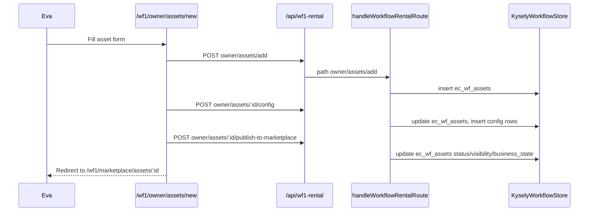
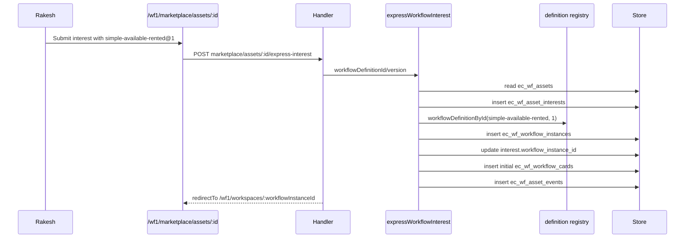
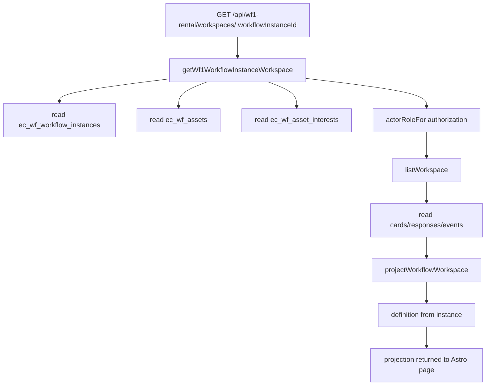
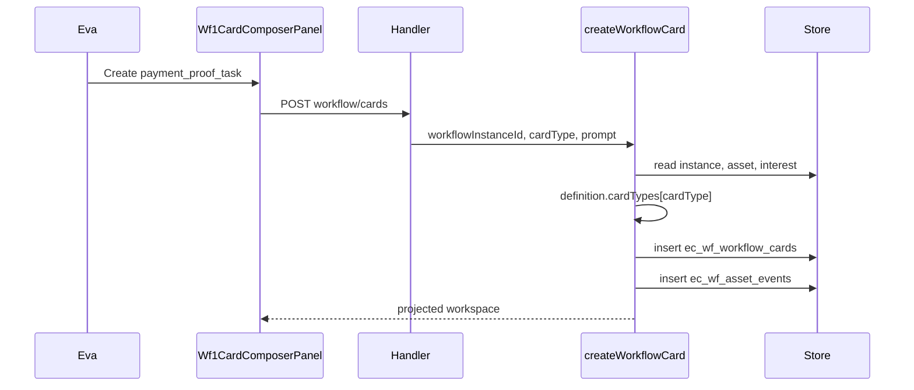
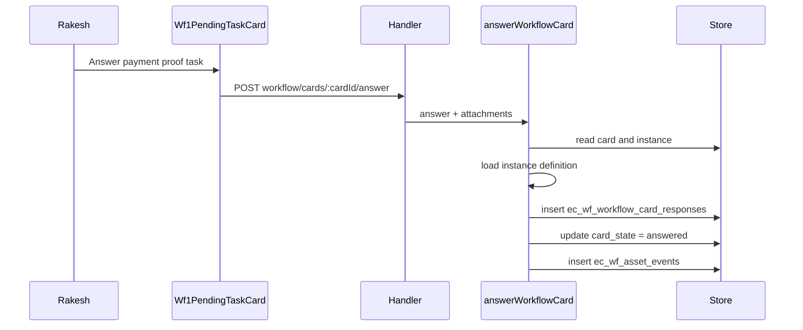
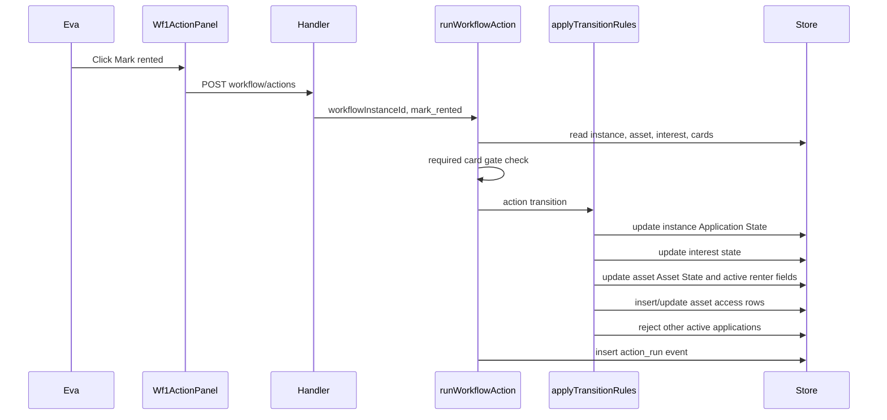
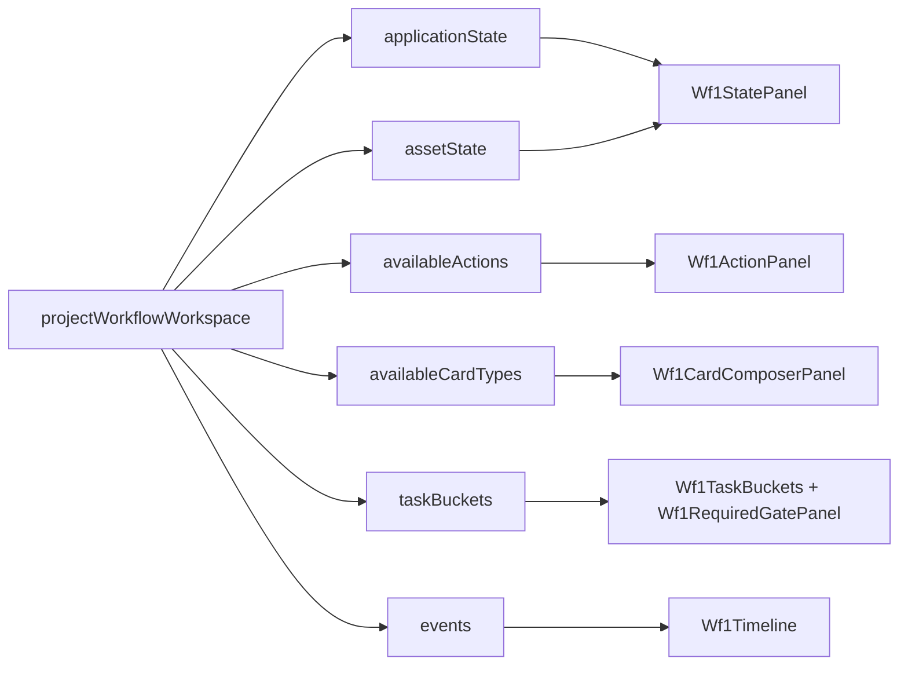

# WF1 Code Flow And Data Flow

This document describes the implemented `/wf1` runtime flow. It uses the manager names Eva for `owner_manual_created_1@example.com` and Rakesh for `tenant_manual_created_1@example.com`.

## Runtime Shape

`/wf1` is isolated from the older `/wf` implementation. Browser pages call `/api/wf1-rental/*`, which enters `demos/playground/src/pages/api/wf1-rental/[...path].ts`, builds a `KyselyWorkflowStore`, then delegates to `handleWorkflowRentalRoute()` in `demos/playground/src/lib/wf1/api/handler.ts`.

The handler is intentionally thin. It parses JSON, checks the logged-in user, dispatches to wf1 commands or queries, and returns `{ ok: true, data }` or `{ ok: false, error }`.

The generic engine behavior comes from workflow definitions in `demos/playground/src/lib/wf1/definitions/registry.ts`. A workflow instance stores `definition_id` and `definition_version`; commands and projections load the matching definition with `workflowDefinitionForInstance(instance)`.

## Definition Lookup

The default wf1 definition is `simple-available-rented@1`. It starts Application State at `available`, expects Asset State `listed`, exposes owner-created `owner_task` and `payment_proof_task` cards, and exposes the owner action `mark_rented`.

Cards have no transitions in this teaching workflow. `mark_rented` is the only transition gate: it moves Application State to `rented`, Asset State to `rented`, restricts visibility, activates Rakesh as renter, grants access to Eva and Rakesh, and rejects other active applications for the same asset.

```mermaid
flowchart LR
  A[Workflow instance row] --> B{definition_id + definition_version}
  B --> C[definitions/registry.ts]
  C --> D[simple-available-rented@1]
  C --> E[alm-current-parity@1]
  D --> F[Commands and projection use definition data]
```

## Asset Creation And Publish

Eva opens `/wf1/owner/assets/new`. The page is a product page, not workflow UI. It posts to `/api/wf1-rental/owner/assets/add`, then `/api/wf1-rental/owner/assets/:id/config`, and optionally `/api/wf1-rental/owner/assets/:id/publish-to-marketplace`.

The handler calls:

- `createWorkflowAsset()` inserts `ec_wf_assets` with draft/private asset data.
- `updateWorkflowAssetConfig()` updates asset config and inserts config item rows in `ec_wf_asset_config_items`.
- `publishWorkflowAsset()` updates the asset to published marketplace visibility and listed Asset State.



## Express Interest With Definition

Rakesh opens `/wf1/marketplace/assets/:id`, selects `simple-available-rented@1`, accepts Eva's conditions, and submits interest.

The page posts `workflowDefinitionId` and `workflowDefinitionVersion` to `/api/wf1-rental/marketplace/assets/:id/express-interest`. The handler calls `expressWorkflowInterest()`.

Inside the command:

- Load Eva's asset from `ec_wf_assets`.
- Insert Rakesh's interest into `ec_wf_asset_interests`.
- Call `createInitialWorkflowInstance()` with the selected definition.
- Insert `ec_wf_workflow_instances` with `definition_id`, `definition_version`, and `workflow_state = available`.
- Update the interest with `workflow_instance_id`.
- Call `createInitialWorkflowCards()`, which loads the instance definition and inserts the automatic `application_note` into `ec_wf_workflow_cards`.
- Insert an `interest_submitted` row in `ec_wf_asset_events`.
- Return `redirectTo: /wf1/workspaces/:workflowInstanceId`.



## Workspace Load By Instance

`/wf1/workspaces/[workflowInstanceId].astro` is the only workflow page. It calls `GET /api/wf1-rental/workspaces/:workflowInstanceId`.

The handler calls `getWf1WorkflowInstanceWorkspace()`:

- Load instance from `ec_wf_workflow_instances`.
- Load asset from `instance.asset_id`.
- Load interest from `instance.interest_id`.
- Use `actorRoleFor()` to ensure the viewer is Eva, Rakesh, or the active renter.
- `listWorkspace()` reads cards, responses, and events for the instance.
- `projectWorkflowWorkspace()` loads the instance definition and returns Asset State, Application State, task buckets, available card types, available actions, gates, and timeline data.



## Owner Creates Task Card

Eva creates a task from the workspace's Available Task Cards panel. The panel renders only `projection.availableCardTypes`.

The form posts to `/api/wf1-rental/workflow/cards`. The handler calls `createWorkflowCard()`:

- Load workflow instance first.
- Load definition with `workflowDefinitionForInstance(instance)`.
- Resolve the selected card type from that definition.
- Authorize Eva through `actorRoleFor()` and `assertWorkflowRole()`.
- Check allowed Application State and Asset State through definition data.
- Insert `ec_wf_workflow_cards`.
- Apply card transitions. In `simple-available-rented@1`, there are none.
- Insert a `card_created` event.
- Return the projected workspace.



## Applicant Answers Task Card

Rakesh sees the card in `projection.taskBuckets.myOpenTasks`. The generic `Wf1PendingTaskCard` renders an answer form from `answer_schema`.

The form posts to `/api/wf1-rental/workflow/cards/:cardId/answer`. The handler calls `answerWorkflowCard()`:

- Load card.
- Load instance.
- Load definition with `workflowDefinitionForInstance(instance)`.
- Resolve the card type from the definition.
- Authorize Rakesh as applicant or renter.
- Validate answer shape and evidence policy.
- Insert `ec_wf_workflow_card_responses`.
- Update card state to `answered`.
- Apply card transitions. In `simple-available-rented@1`, there are none.
- Insert a `card_answered` event.



## Owner Runs Mark Rented

Eva sees `mark_rented` in `projection.availableActions`. If a required payment proof card is unresolved, projection marks it blocked and the command also rejects the action with `UNRESOLVED_REQUIRED_CARDS`.

When Rakesh answers the required card, Eva can submit `mark_rented` to `/api/wf1-rental/workflow/actions`. The handler calls `runWorkflowAction()`:

- Load instance first.
- Load definition with `workflowDefinitionForInstance(instance)`.
- Resolve `definition.actions.mark_rented`.
- Authorize Eva as owner.
- Recalculate unresolved required cards using the same definition.
- Apply the action transition:
  - update `ec_wf_workflow_instances.workflow_state` to `rented`;
  - update `ec_wf_asset_interests.interest_state` to `rented`;
  - update `ec_wf_assets.business_state` to `rented`;
  - update visibility to restricted;
  - set `active_interest_id`, `active_workflow_instance_id`, and `active_renter_user_id`;
  - grant asset access rows;
  - reject other non-terminal applications for the same asset.
- Insert an `action_run` event.



## Projection To UI Rendering

Astro pages do not decide workflow behavior. `/wf1/workspaces/[workflowInstanceId].astro` renders only the projection:

- `Wf1StatePanel` shows Asset State and Application State.
- `Wf1ActionPanel` renders `availableActions`.
- `Wf1CardComposerPanel` renders `availableCardTypes`.
- `Wf1RequiredGatePanel` renders `taskBuckets.requiredUnresolvedTasks`.
- `Wf1TaskBuckets` renders `myOpenTasks`, `otherSideOpenTasks`, and completed cards.
- `Wf1Timeline` renders events.



## Test Coverage

The wf1 unit/API tests live under `demos/playground/tests/wf1`.

- `definition-registry.test.ts` checks registry lookup and unknown-definition failure.
- `simple-workflow.test.ts` checks the teaching workflow rules: cards do not change state, required payment proof blocks `mark_rented`, and the action changes Application State and Asset State.
- `workspace-projection.test.ts` checks projection fields, available cards/actions, and task buckets.
- `routes.test.ts` checks the route handler, explicit definition selection, wrong-applicant authorization, private workspace authorization, and the full mark-rented API flow.

The headed UI flow is `e2e/tests/wf1-simple-ui.spec.ts`. It uses persistent local users: Eva logs in as `owner_manual_created_1@example.com`; Rakesh logs in as `tenant_manual_created_1@example.com`.
